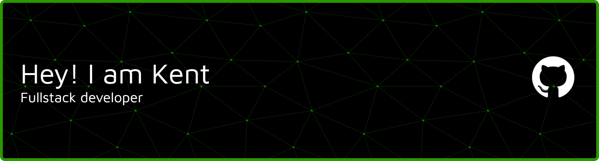

---

## 🧑‍💻 About Me

- 🎓 **Student** at [Pontifical Catholic University of Peru (PUCP)](https://www.pucp.edu.pe/)
- 🔭 Currently working on **personal projects** and university coursework
- 🌱 Learning **Firebase, Android Development & Spring Boot**
- 💡 Interested in **Backend Development, DevOps, and Cloud Infrastructure**
- 🤝 Open to collaborating on **Python, C/C++, Java, and Web projects**
- 💬 Ask me about anything! I love discussing tech and problem-solving
- ⚡ Fun fact: I enjoy automating repetitive tasks with Bash scripts

---

## 🌐 Connect With Me

---

## 🛠️ Tech Stack

### Languages

### Frameworks & Libraries

### Tools & Platforms

### IDEs & Collaboration

---

## 🎵 Now Playing

---

## 🔥 Contribution Graph

<picture>
  <source media="(prefers-color-scheme: dark)" srcset="https://raw.githubusercontent.com/Bearserker10029/Bearserker10029/output/bomberman-contribution-graph-dark.svg">
  <source media="(prefers-color-scheme: light)" srcset="https://raw.githubusercontent.com/Bearserker10029/Bearserker10029/output/bomberman-contribution-graph.svg">
  
</picture>

---

**Thanks for visiting my profile!** 🚀

